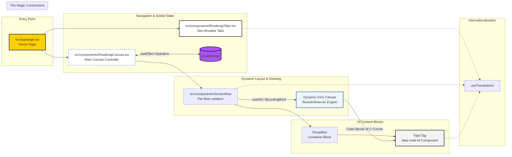

# DevDreams Project Architecture

```mermaid
graph LR
    subgraph Core_Entry [Entry Point]
        Page[src/app/page.tsx<br/>Home Page]
    end

    subgraph State_and_Tabs [Navigation & Global State]
        Tabs[src/components/RoadmapTabs.tsx<br/>Neo-Brutalist Tabs]
        Canvas[src/components/RoadmapCanvas.tsx<br/>Main Canvas Controller]
        LocalStorage[(localStorage)]

        Page --> Tabs
        Page --> Canvas
        Canvas <-->|useEffect Hydration| LocalStorage
    end

    subgraph Layout_Engine [Dynamic Layout & Drawing]
        Row[src/components/SectionRow<br/>Per-Row Isolation]
        SVG[Dynamic SVG Canvas<br/>ResizeObserver Engine]

        Canvas --> Row
        Row -->|useRef / BoundingRect| SVG
    end

    subgraph Content_Nodes [UI Content Blocks]
        Group[GroupBox<br/>Container Block]
        Tag[TopicTag<br/>data-node-id Component]

        Row --> Group
        Group --> Tag
    end

    subgraph Connection_Lines [The Magic Connections]
        SVG -->|Cubic Bezier M C Curves| Tag
    end

    subgraph Localization [Internationalization]
        i18n[useTranslations]
        Tabs -.-> i18n
        Row -.-> i18n
        Tag -.-> i18n
    end

    style Page fill:#ffd000,stroke:#000,stroke-width:2px
    style Tabs fill:#fff,stroke:#000,stroke-width:2px,shadow
    style Canvas fill:#fff,stroke:#3b82f6,stroke-width:2px,stroke-dasharray: 5 5
    style SVG fill:#eff6ff,stroke:#1d4ed8,stroke-width:2px
    style LocalStorage fill:#a855f7,stroke:#000,stroke-width:2px
    style Tag fill:#f4f4f5,stroke:#000,stroke-width:2px
```
